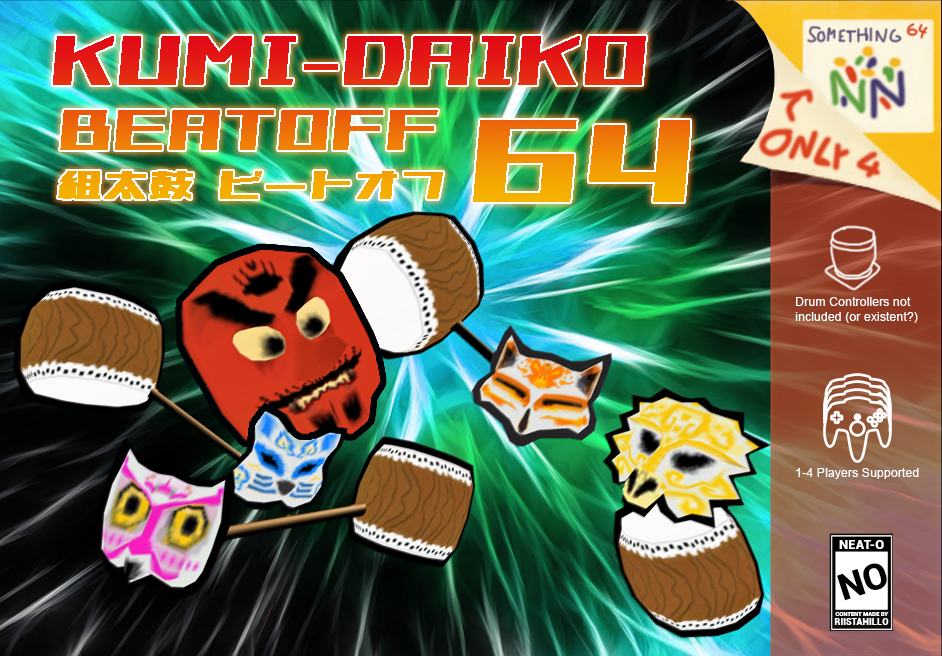

# Kumi-Daiko Beatoff 64

## About the game

It's a Bumpin', Boomin', Blastin' Beatoff! The mythical Super Percussion Cousins collide in this ultimate showdown of whippiness and cunning! Up to four players can choose their favorite animal face - complete with their own color - and go at it in Survival mode and last-mask-standing Battles. Or beat away at angry masks that would rather have you quiet in single-player mode. Either way, Kumi-Daiko Beatoff 64 is a no-barrels-held whip-fest that will keep you coming back for more!

Whip out your instrument and bust into battle with your favorite mask: Fox, Cat, Owl or Monkey! ...not that there’s any mechanical difference.
Hit a mask with a high-velocity drum to beat some life out of it!
Avoid other players’ whipping instruments & use your drum as a shield from danger
Compete in the state of the art 64-bit arena until the end of time, having fun whackin’ with everyone you love!

##### Game modes:

- Survival: 1-4 players – destroy angry masks
- Battle: 2-4 players - fight against other players

##### Controls:

- D-pad: Menu selection
- A: Select game mode
- Stick: Move player
- Start: Stop round

This game is an entry for the first ever N64brew Game Jam. See: https://zhamul.itch.io/kumi-daiko-beatoff-64

## Building from source

### Recommended dev environment

Debian is a good OS choice for development. As the IDE we have been using CLion, with `./scripts/build.sh` set as the build program and `./scripts/run_cen64.sh` as the executable. This way CLion is will pick up locations for any build errors from the build script console output, which makes development easier.

A good choice is to run Debian in VmWare player with the project in a shared directory, this makes it easy to run any tools such as the Project64 emulator which do not run well in wine.

### Scripts

##### build.sh
Builds project, outputs .n64 file. 

- Requires wine. N64 libraries and N64 Sound Tools must be extracted to the wine C:/ folder, e.g. `~/.wine/drive_c/`.

- http://ultra64.ca/files/software/other/sdks/n64sdk.7z
- http://ultra64.ca/files/software/other/sdks/n64dev.zip

Usage: `./scripts/build.sh`

##### run_cen64.sh
Runs cen64 emulator on linux. 

- pifdata.bin must be placed in the `tools/cen64` directory.

Usage: `./scripts/run_cen64.sh`

##### import_model.sh
Generates n64 displaylist .h header file for .obj model.
- The .obj file, .mtl file, and the .bmp texture must be placed in `./models/model_name`.
- Model name and texture file names must be C compatible (no dots/spaces/dashes/etc).
- If using blender to export .obj file, export objects must be disabled and export groups must be enabled in the export settings.

Usage: `./scripts/import_model.sh model_name`

### Third-party tools

##### objn64
Converts .obj files to displaylist .h header files.

##### cen64
Cycle-accurate Nintendo 64 emulator (slow), Windows/Linux.

##### project64
Nintendo 64 emulator, Windows only.

